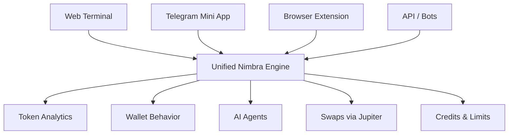

# Nimbra Trading

AI-powered crypto trading terminal built for risk-first decision making on top of real on-chain data

---

> [!IMPORTANT]
> Nimbra Trading is a non-custodial platform — you always stay in control of your funds and must approve every transaction in your wallet

## What’s Broken Today

Most trading workflows are fragmented and misleading

You look at charts without understanding liquidity  
You follow wallets without knowing their real behavior  
You trade without seeing your own risk profile  

Tools optimize for signals and noise — not for survival and decision quality  

---

## What Changes With This

Nimbra Trading connects everything into one risk-aware system

Instead of switching between tools, you operate inside one interface where:

- tokens are analyzed structurally, not visually  
- wallets are profiled as behavior, not hype  
- AI translates raw data into decisions  
- swaps are executed only when risk still makes sense  

> [!WARNING]
> Nimbra does not trade for you — every action must be reviewed and signed manually

---

## Proof It Works

A typical flow becomes shorter and sharper

| Step | Traditional Workflow | With Nimbra |
|------|---------------------|------------|
| Token check | Chart + Twitter + guess | Structured analytics + risk overlays |
| Wallet check | Explorer + manual reading | PnL + behavior + exposure |
| Decision | Intuition + noise | Data + AI interpretation |
| Execution | Separate DEX | Direct Jupiter routing |

Result: fewer blind entries, clearer exits, less emotional noise  

---

## Try the Core Flow

The fastest way to understand Nimbra

1. Connect your wallet  
2. Analyze one token you actually trade  
3. Analyze your own wallet behavior  
4. Run 1 AI agent summary  
5. Decide — ignore or proceed to swap  

> [!TIP]
> Start with something you already hold — it makes the analytics easier to validate

---

## Real Scenarios

### Risk-first entry
You see a trending token → check liquidity and holder structure → skip before slippage kills you  

### Wallet validation
You find a “smart wallet” → analyze PnL and drawdowns → realize it’s just lucky, not consistent  

### Self-audit
You review your own wallet → detect over-sizing after losses → adjust behavior before next trade  

---

## Product View

Nimbra is one system across multiple surfaces

---

## Mechanics in Brief

Under the hood, Nimbra runs a simple but strict pipeline

| Layer | Function |
|------|--------|
| Data | On-chain + market data ingestion |
| Processing | Normalization + risk metrics |
| Intelligence | AI agents interpret signals |
| Execution | Swap routing via Jupiter |
| Access | Credits + $NIMBRA token |

> [!NOTE]
> All heavy actions (scans, agents) consume credits — same logic across UI and API

---

## Compared to Alternatives

| Approach | Limitation | Nimbra Difference |
|----------|-----------|------------------|
| Chart tools | Price-only view | Adds liquidity, flows, structure |
| Wallet trackers | Raw data, no context | Behavior + PnL + patterns |
| Trading bots | Black-box execution | Full control, no automation by default |
| Manual workflow | Fragmented tools | Unified system |

---

## Failure Cases

Nimbra is not designed for everything

- If you want fully automated trading → not the right tool  
- If you trade purely on memes or speed → may feel slower  
- If you ignore risk metrics → product loses its value  

> [!CAUTION]
> This is a decision-support system, not a profit guarantee

---

## Credits & Token Model

| Element | Description |
|--------|------------|
| $NIMBRA | Utility token used for credits and plans |
| Credits | Used for scans, agents, analytics |
| Burn | 80% of usage is burned |
| Treasury | 20% goes to protocol treasury |

No promises of yield or returns — purely utility-driven  

---

## API & Integrations

- HTTP API with job-based execution  
- Webhooks for async results  
- Same engine as terminal  

Use cases:
- bots  
- dashboards  
- alert systems  

---

## Final Note

Nimbra is built around one idea:

Trade with a risk brain, not just a price chart
